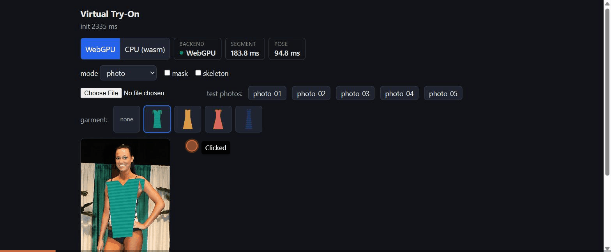

# Virtual Try-On

A browser-native virtual try-on app: garments render on top of a photo or a
live webcam feed, entirely on-device. No server-side inference, no video
ever leaves the browser.



## Why this exists

Most virtual try-on products ship a server-side diffusion model — expensive
per-inference, and a privacy non-starter for a lot of shoppers. This is the
other end of that trade-off: a segmentation model, a pose model, and a
thin-plate-spline garment warp, all running client-side via [LiteRT.js](https://ai.google.dev/edge/litert/web)
on WebGPU. The preview is instant and free to serve at any scale — the
economics of a static site — with a clear path to a paid, photorealistic
server-side tier later for buyers who want a print-quality render.

It's also a portfolio piece: a from-scratch on-device ML pipeline (custom
worker protocol, a hand-rolled thin-plate-spline solver, a canvas triangle-mesh
warp renderer) rather than a wrapper around someone else's SDK.

## How it works

```
webcam/photo ──► [Worker: LiteRT.js]
                   ├─ segmenter ──► person mask ──────┐
                   └─ pose ──► 17 keypoints ─► TPS ───┤
                                                       ▼
main thread ◄──────────────────── compositor (canvas 2D)
```

1. **Segmentation** (MediaPipe Selfie Segmenter) produces a person-confidence
   mask.
2. **Pose estimation** (MoveNet SinglePose Lightning) produces 17 body
   keypoints.
3. Six garment anchors (shoulders, waist, hem) are mapped from garment-image
   pixel space onto the detected body via a **thin-plate-spline warp**,
   rendered as a coarse mesh of affine-textured triangles (canvas 2D can't do
   a true nonlinear warp, so this approximates one locally per triangle).
4. The warped garment is clipped to the feathered person mask and composited
   over the frame; a capsule-shaped clip restores original arm pixels over
   the fabric so a hand-on-hip pose still reads correctly (approximate depth
   ordering, no real per-limb depth signal).

Both models run in a Web Worker; only mask/keypoint results and transferred
`ImageBitmap`s cross back to the main thread — the video frame itself never
touches the network layer, this is the whole "privacy" pitch made literal.

## Status

| Phase | What | Status |
|---|---|---|
| 1 | Segmentation + pose on a static photo, WebGPU confirmed, CPU fallback | ✅ |
| 2 | TPS garment warp + compositor, verified on 3 poses | ✅ |
| 3 | Live webcam, throttled inference, keypoint smoothing | ✅ |
| 4 | Perf UI polish, README, static deploy | ✅ (this) |
| — | Sarees (draped, not fitted — needs a different approach entirely) | deferred |

See `CLAUDE.md` for the full build plan and the gotchas that shaped it.

## Try it

```bash
npm install                    # postinstall copies the LiteRT.js wasm runtime into public/
npm run fetch-models           # downloads the two .tflite models (~5 MB) into public/models/
npm run fetch-test-photos      # downloads free-license test photos into public/test-photos/
npm run dev
```

Needs a WebGPU-capable browser for the fast path (Chrome/Edge 113+); falls
back to a Wasm/XNNPack CPU path everywhere else — toggle between them in the
UI to see the difference (this repo's demo GIF shows both).

To add a garment: drop a background-removed PNG in `public/garments/`, open
`tools/annotate.html`, click the six anchors, and append the exported JSON to
`src/garments/catalog.json`. The four garments shipped here are placeholder
flat-silhouette illustrations (`tools/generate-placeholder-garments.mjs`) —
real photographic cutouts with clean alpha transparency are surprisingly
hard to source under a free license, so this is the honest stand-in until
real catalog photography is annotated.

## Stack

Vite + React + TypeScript (strict). `@litertjs/core` for model loading/inference,
`@tensorflow/tfjs-*` only for GPU-resident preprocessing (letterboxing, dtype
casts) sharing LiteRT's WebGPU device — no tfjs models, no server, no
backend, no analytics. `src/pipeline/` is framework-free (no React) and unit
tested with Vitest — the TPS solver, keypoint smoothing, and letterbox math
all have tests independent of the UI.

## Deploying

`npm run build` produces a static `dist/` — this repo deploys it to GitHub
Pages via `.github/workflows/deploy.yml` on every push to `main`. Any static
host works identically (Vercel, Netlify, S3 — there's no server component to
provision).
