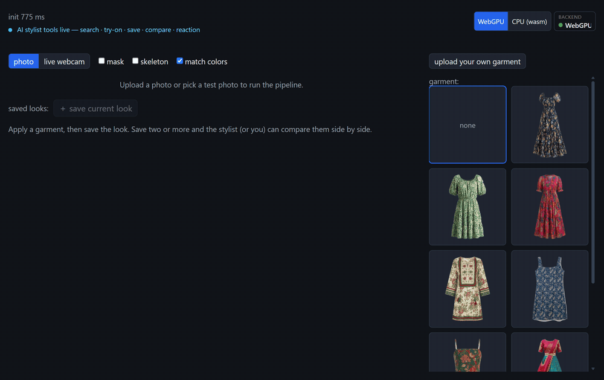

# Virtual Try-On + AI Stylist

A browser-native virtual try-on app with a **WebMCP agent-stylist loop** on top:
garments render on a photo entirely on-device (no server inference, no upload),
and an AI agent can search the catalog and apply try-ons through
[WebMCP](https://webmachinelearning.github.io/webmcp/) site tools while the
human judges fit and vibe.

**▶ Live: <https://pravoobi.github.io/try-on/>**



**GitHub topics:** `webmcp` `model-context-protocol` `ai-agents` `virtual-try-on`
`litert` `litertjs` `webgpu` `on-device-ml` `react` `react-hooks` `computer-vision`
`tflite` `thin-plate-spline` `image-warping` `pose-estimation` `image-segmentation`
`typescript` `vite` `npm-package` `monorepo`

---

## The AI stylist loop (WebMCP)

The page registers five tools on `document.modelContext` — the
[WebMCP](https://webmachinelearning.github.io/webmcp/) API, used natively where
the browser ships it (recent Chrome) and polyfilled otherwise by
[`@mcp-b/global`](https://www.npmjs.com/package/@mcp-b/global). Any WebMCP
client — ChatGPT's built-in browser, a Chrome agent, Claude via a WebMCP
bridge extension — discovers them automatically and can drive a **styling
conversation**:

> **you** — style me for a sangeet under ₹8k
>
> **agent** — *calls `search_catalog({ occasion: "sangeet", maxPrice: 8000 })`, then `apply_tryon({ garmentId: "dress-magenta-wrap-01" })`* — "Tried on the Magenta Wrap Maxi Dress (₹4,800), the only sangeet option under your budget. How does it look?"
>
> **you** — love it
>
> **agent** — *calls `await_reaction({ reaction: "love" })`, then `save_look({ label: "magenta sangeet" })`* — "Saved. Want to see a lehenga alongside it?"

| Tool | Signature | What it does |
|---|---|---|
| `search_catalog` | `{ query?, occasion?, color?, category?, maxPrice? }` | Filters the catalog; keyword-ranked. Returns id / name / price / colour / occasion. |
| `apply_tryon` | `{ garmentId }` | Runs the on-device pipeline and composites the garment onto the photo. Loads a default model photo if none is picked, so the flow works cold. |
| `save_look` | `{ label? }` | Snapshots the composited preview + worn garment ids into the looks tray. |
| `compare_looks` | `{ lookIds }` | Opens a side-by-side view of saved looks for the human to choose between. |
| `await_reaction` | `{ reaction?, note?, timeoutSeconds? }` | Gets the human's verdict — pass `reaction` (`love` / `like` / `try_another` / `reject`) if they said it in chat, or omit it to block until they tap a reaction chip in the app. Returns next-step guidance. |

Every tool points at logic the page already has (`src/webmcp/useStylistTools.ts`
is a thin adapter over the garment picker, the looks tray, and the reaction
bar) — **no new business logic, no server, no DOM scraping.**

### Designed for a human in the loop

The interesting half of an agent stylist is that only the human can judge fit
and vibe, so the app makes that exchange first-class:

- **The agent's move is visible.** When the *agent* applies a try-on (not a
  manual tap), the preview gets a border sweep and a "🎨 Stylist put you in …"
  banner.
- **The human's reaction is structured.** Four reaction chips (Love it / Good /
  Try another / Not this) + an optional "what to change" note. `await_reaction`
  bridges both channels — a chip tap *or* a sentence in chat — into the same
  `{ reaction, note, guidance }` the agent acts on.
- **The human always wins.** The agent proposes and explains trade-offs
  (budget, occasion, silhouette); the person picks. The tools have no way to
  "buy" or commit anything.

### Try the tools yourself

- **ChatGPT** desktop app's built-in browser → open the live URL → prompt
  `use sitetools: style me for a brunch outfit under ₹3k`. (Needs a
  WebMCP-enabled model; ChatGPT is conservative about invoking site tools, so
  naming them explicitly helps.)
- **Recent Chrome** → open the live URL → use the browser's built-in agent.
- **Claude / Cursor** → install a WebMCP bridge extension, point your MCP
  client at it, open the live URL, and chat.
- **Headless smoke test** → `npm run dev` then `npm run smoke:webmcp` — a
  Playwright run that drives all five tools end to end (19 assertions).
- **Console** → `await document.modelContext.getTools()`, then
  `document.modelContext.executeTool(tool, JSON.stringify(args))` (the tool's
  own return is under the result's `structuredContent`).

---

## Why it runs on-device

Most virtual try-on products ship a server-side diffusion model — expensive
per inference, and a privacy non-starter for a lot of shoppers. This is the
other end of that trade-off: a segmentation model, a pose model, and a
thin-plate-spline garment warp, all running client-side via
[LiteRT.js](https://ai.google.dev/edge/litert/web) on WebGPU. The preview is
instant and free to serve at any scale — the economics of a static site —
with a clear path to a paid, photorealistic server-side tier later for buyers
who want a print-quality render.

The webcam/photo frame never touches the network layer. That's the whole
"privacy" pitch, made literal.

It's also a portfolio piece: a from-scratch on-device ML pipeline — custom
Worker protocol, a hand-rolled thin-plate-spline solver, a canvas
triangle-mesh warp renderer — rather than a wrapper around someone else's SDK.
The pipeline is published as its own package,
[`@practics/tryon-core`](https://www.npmjs.com/package/@practics/tryon-core);
the app is a thin React shell over it.

## How the pipeline works

```
webcam/photo ──► [Worker: LiteRT.js]
                   ├─ segmenter ──► person mask ──────┐
                   └─ pose ──► 17 keypoints ─► TPS ───┤
                                                       ▼
main thread ◄──────────────────── compositor (canvas 2D)
```

1. **Segmentation** ([MediaPipe Selfie Segmenter](https://ai.google.dev/edge/mediapipe/solutions/vision/image_segmenter))
   produces a person-confidence mask.
2. **Pose estimation** ([MoveNet SinglePose Lightning](https://www.kaggle.com/models/google/movenet))
   produces 17 body keypoints.
3. Six garment anchors (shoulders, waist, hem) are mapped from garment-image
   pixel space onto the detected body via a **thin-plate-spline warp**,
   rendered as a coarse mesh of affine-textured triangles (canvas 2D can't do
   a true nonlinear warp, so this approximates one per triangle).
4. The warped garment is clipped to the feathered person mask and composited
   over the frame; an arm-capsule clip restores original arm pixels over the
   fabric so a hand-on-hip pose still reads correctly.

Both models run in a Web Worker (~5 MB, downloaded once); only mask/keypoint
results and transferred `ImageBitmap`s cross back to the main thread.

**Beyond the base pipeline** — all optional, most behind an opt-in button:

- **Live webcam mode** with One-Euro keypoint smoothing, a fullscreen kiosk
  view, hands-free swipe gestures, and a photo-capture countdown.
- **Multi-piece garments** — a lehenga-choli renders choli + skirt on their own
  anchors so the skirt flares independently.
- **"Enhance (3D)"** — a monocular depth model
  ([Depth-Anything-V2-small](https://huggingface.co/onnx-community/depth-anything-v2-small))
  drives depth-tested occlusion and single-light relighting of the flat
  garment photo; a MODNet matte replaces the low-res segmenter mask for
  hair-strand-level edges in stills.
- **Colour harmonization** — a clamped nudge of the garment layer's exposure
  and colour cast toward the light measured on the person.
- **Upload your own garment** — background removal + (for on-model photos) a
  clothes-parsing model to strip the wearer, then a drag-to-place anchor
  editor with a live composited preview.

## The catalog

Eight curated garments — three western dresses, three kurtis, two lehengas —
all **real product photography**, background-removed and hand-anchored. Each
carries `meta.name` / `price` (₹) / `occasion` / `color`, which is what
`search_catalog` reasons over:

| | ₹ | occasions |
|---|--:|---|
| Magenta Wrap Maxi Dress | 4,800 | sangeet, reception, party, cocktail |
| Navy Floral Maxi Dress | 4,200 | party, reception, brunch, date-night |
| Emerald Floral Midi Dress | 3,200 | party, brunch, daytime |
| Cream Embroidered Kurti | 2,600 | festive, mehendi, daytime, office |
| Indigo Floral A-line Kurti | 1,800 | casual, daytime, office, brunch |
| Pink Floral Sleeveless Kurti | 1,900 | casual, daytime, brunch |
| Blush Pink Lehenga Choli | 12,500 | wedding, sangeet, reception |
| Sangria Red Lehenga Choli | 13,500 | wedding, sangeet, reception |

`tools/process-new-garments.mjs` turns a raw studio photo into a catalog-ready
PNG + suggested anchors: it keys out the background with a **flood fill from
the image border**, not a per-pixel colour distance — a plain key punches
transparent holes through any light print motif that resembles the backdrop,
so the fill only removes a pixel if it's actually *connected* to the edge. The
anchor suggestion is a starting point, not the final word (it can mistake a
puff sleeve for the shoulder line), so always render a new garment against a
test photo and hand-correct before trusting it. To add one by hand: drop a
PNG in `public/garments/`, open `tools/annotate.html`, click the six anchors,
append the JSON to `src/garments/catalog.json`.

## Run it locally

```bash
npm install            # postinstall copies the LiteRT.js wasm runtime into public/
npm run fetch-models   # downloads the .tflite models (~5 MB) into public/models/
npm run dev
```

Test photos (free-license Wikimedia Commons stills, see
`public/test-photos/ATTRIBUTION.md`) are checked in, so the quick-load buttons
work right away.

Needs a WebGPU-capable browser for the fast path (Chrome/Edge 113+); falls
back to a Wasm/XNNPack CPU path everywhere else — toggle between them in the
UI to see the difference.

```bash
npm test               # app unit tests (Vitest) — searchCatalog, etc.
npm run smoke:webmcp    # end-to-end WebMCP tool check (Playwright; needs `npm run dev`)
npm run test:all        # build + test every workspace package, then the app
```

## Repo layout

```
src/                        the app — a React/TS shell
  webmcp/                    WebMCP tool registration + catalog search
  components/                video canvas, garment picker, looks panel, reaction bar
  hooks/                     useWebcam, usePipeline, useLooks, useReaction, …
  garments/                  catalog.json + schema/validation
tools/                       garment processing, model fetch, smoke test
packages/
  tryon-core/               @practics/tryon-core — the framework-free pipeline
  litert-react/             litert-react — Worker/model-loading React integration
  thin-plate-spline/        thin-plate-spline — the TPS solver, zero deps
```

The three `packages/*` are published to npm and versioned independently; the
app depends on them like any other consumer would.

## Stack

Vite + React + TypeScript (strict). `@litertjs/core` for model
loading/inference, `@tensorflow/tfjs-*` only for GPU-resident preprocessing
sharing LiteRT's WebGPU device (no tfjs models),
`@huggingface/transformers` for the opt-in advanced-mode models,
`@mcp-b/global` + `@mcp-b/react-webmcp` for WebMCP. No server, no backend, no
analytics.

## Deploying

`npm run build` produces a static `dist/`. This repo deploys it to GitHub
Pages via `.github/workflows/deploy.yml` on every push to `main`. Any static
host works identically — there's no server component to provision.
